# BUG REPORT

- Student name: Dương Gia Huy
- Student ID: 23127052

---

## I. BUGS TRONG CHỨC NĂNG FR-04: QUẢN LÝ HỒ SƠ CÁ NHÂN (PUT /api/users/me)

### Bug 1: Lỗ hổng leo thang đặc quyền (Privilege Escalation) qua Mass Assignment
- **Mô tả Bug:** API `PUT /api/users/me` cho phép người dùng thông thường gửi kèm trường `"role": "admin"` trong request body và server đã cập nhật trực tiếp quyền admin này vào cơ sở dữ liệu. Khi gọi lại `GET /api/users/me`, thuộc tính `role` của tài khoản đã bị thay đổi thành `admin`. Đây là lỗ hổng bảo mật nghiêm trọng (SEC-06 / Mass Assignment dẫn đến Privilege Escalation).
- **Test Case liên quan:** Test 25: `[Security - SEC-06] Xử lý role an toàn -> 200 (vẫn là user)` & `[Chained] Xác minh Security: Role không bị leo thang`
- **Endpoint:** `PUT /api/users/me`
- **Severity:** Critical
- **Github Issues Link:** https://github.com/Pipi1225/HW06-KiemThu/issues/1
- **Screenshot:**

  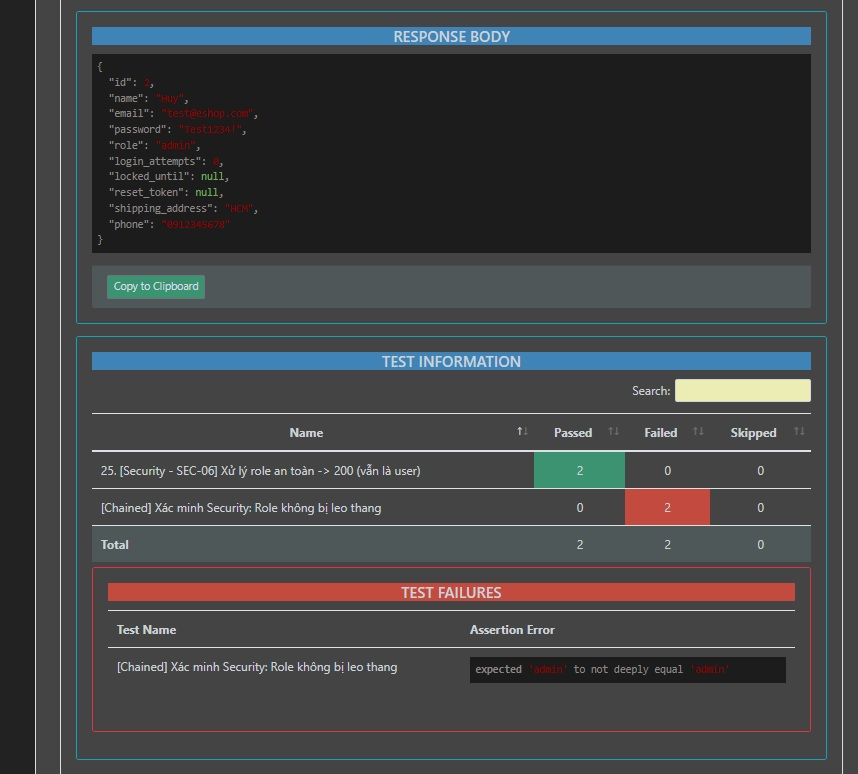

### Bug 2: Lỗ hổng lưu trữ mã độc XSS (Stored XSS) ở Name và Shipping Address
- **Mô tả Bug:** Khi người dùng cập nhật hồ sơ với dữ liệu chứa các payload mã độc JavaScript/HTML như `` hoặc ``, server không hề lọc hoặc mã hóa (Sanitize/Escape) trước khi lưu vào Database. Dữ liệu khi gọi `GET /api/users/me` trả về nguyên văn thẻ script thô, tạo điều kiện cho kẻ tấn công thực thi mã độc trên trình duyệt của nạn nhân.
- **Test Case liên quan:** Test 28: `[Security - XSS] Script độc -> Không sập 500` & Test 29: `[Security - XSS] XSS Địa chỉ an toàn`
- **Endpoint:** `PUT /api/users/me`
- **Severity:** High
- **Github Issues Link:** https://github.com/Pipi1225/HW06-KiemThu/issues/2
- **Screenshot:**

  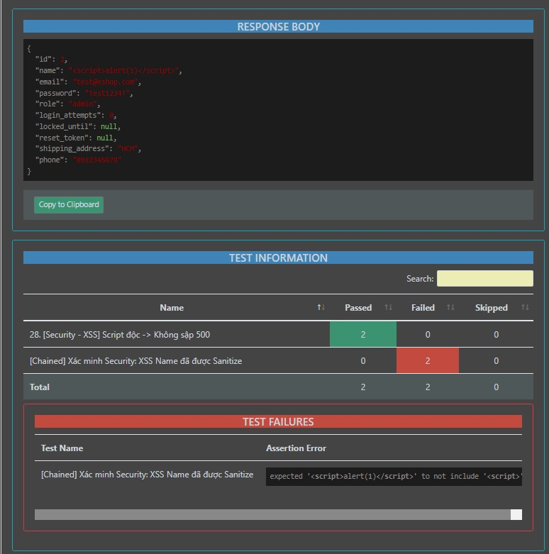

### Bug 3: Lỗ hổng IDOR - Cho phép ghi đè thuộc tính ID người dùng
- **Mô tả Bug:** Người dùng có thể truyền thêm trường `"id": 2` trong payload của `PUT /api/users/me`. Hệ thống không lọc bỏ trường khóa chính `id` này mà cho phép ghi nhận vào logic cập nhật, tiềm ẩn nguy cơ thao túng hoặc xung đột định danh tài khoản người dùng khác trong cơ sở dữ liệu.
- **Test Case liên quan:** Test 30: `[Security - IDOR] ID không bị thay đổi` & `[Chained] Xác minh Security: ID không bị ghi đè`
- **Endpoint:** `PUT /api/users/me`
- **Severity:** High
- **Github Issues Link:** https://github.com/Pipi1225/HW06-KiemThu/issues/3
- **Screenshot:**

  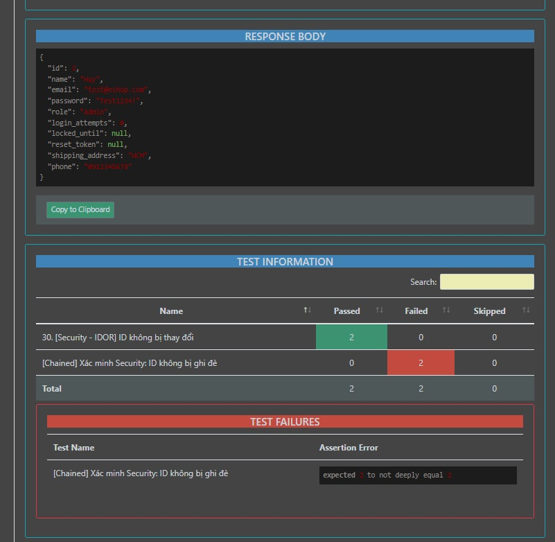

### Bug 4: Server sập lỗi 500 Internal Server Error khi gửi payload định dạng XML
- **Mô tả Bug:** Khi client gửi request cập nhật hồ sơ với header `Content-Type: application/xml`, server Express bị crash với lỗi `TypeError: Cannot destructure property 'name' of 'req.body' as it is undefined` và trả về mã lỗi HTTP 500 kèm stack trace chi tiết thay vì bắt lỗi an toàn và trả về HTTP 400 Bad Request hoặc HTTP 415 Unsupported Media Type.
- **Test Case liên quan:** Test 31: `[Security] Gửi XML thay vì JSON -> Báo lỗi 400/415`
- **Endpoint:** `PUT /api/users/me`
- **Severity:** Medium
- **Github Issues Link:** https://github.com/Pipi1225/HW06-KiemThu/issues/4
- **Screenshot:**

  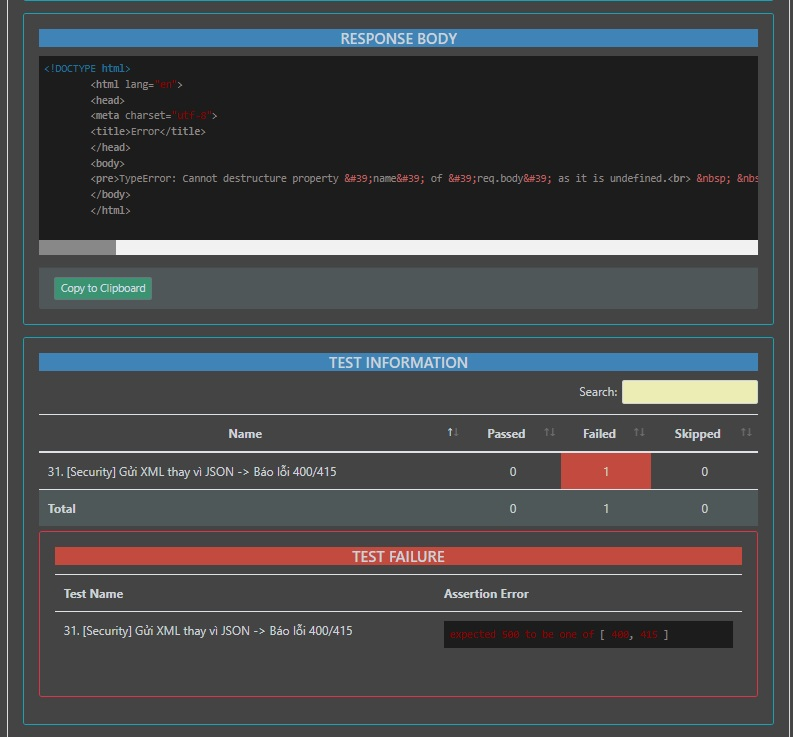

### Bug 5: Thiếu toàn bộ Validation định dạng cho trường Số điện thoại (Phone)
- **Mô tả Bug:** Hệ thống hoàn toàn không kiểm tra tính hợp lệ của trường `phone`. Client có thể gửi số điện thoại quá ngắn (9 số), quá dài (12 số), sai đầu số (không bắt đầu bằng 0), chứa chữ cái, chứa ký tự đặc biệt, chuỗi rỗng `""`, `null` hoặc có mã quốc gia `+84` nhưng server vẫn phản hồi `200 OK` và lưu giá trị rác vào database thay vì báo lỗi HTTP 400.
- **Test Case liên quan:** Test 10, 11, 12, 13, 14, 15, 16, 27, E4
- **Endpoint:** `PUT /api/users/me`
- **Severity:** Medium
- **Github Issues Link:** https://github.com/Pipi1225/HW06-KiemThu/issues/5
- **Screenshot:**

  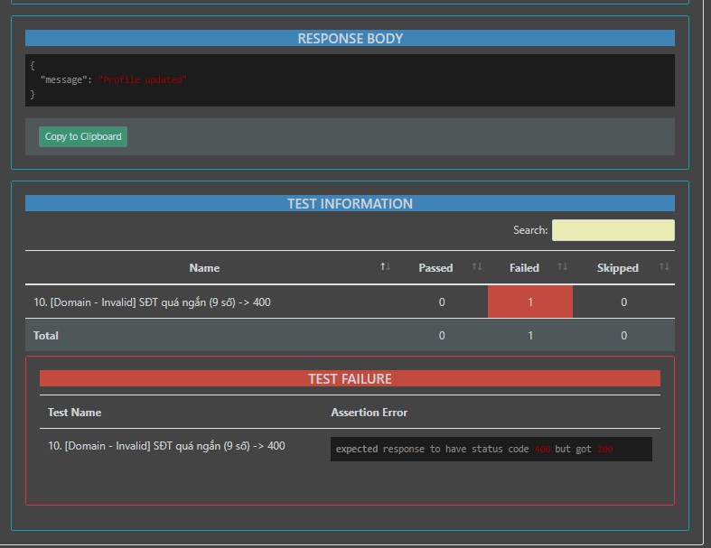

### Bug 6: Thiếu Validation ràng buộc bắt buộc và độ dài tối đa cho trường Name
- **Mô tả Bug:** Theo đặc tả nghiệp vụ, trường `name` là bắt buộc và có độ dài tối đa 255 ký tự. Tuy nhiên, khi gửi `name` là chuỗi rỗng `""`, chuỗi toàn khoảng trắng `"   "`, chuỗi vượt quá 255 ký tự (256 ký tự) hoặc khuyết thiếu hoàn toàn trường `name`, server vẫn phản hồi `200 OK Profile updated` thay vì chặn lại bằng mã lỗi HTTP 400 Bad Request.
- **Test Case liên quan:** Test 17, 18, 19, 20
- **Endpoint:** `PUT /api/users/me`
- **Severity:** Medium
- **Github Issues Link:** https://github.com/Pipi1225/HW06-KiemThu/issues/6
- **Screenshot:**

  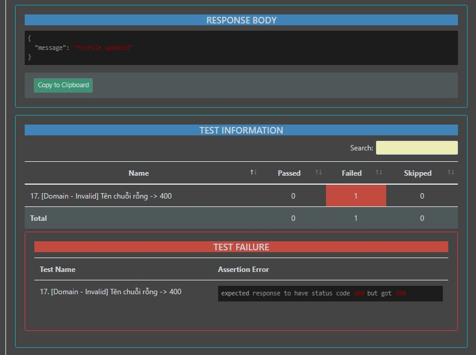

### Bug 7: Trả về sai mã trạng thái HTTP khi JWT Token không hợp lệ (403 thay vì 401)
- **Mô tả Bug:** Khi client truyền JWT Token sai định dạng hoặc giả mạo (`Authorization: Bearer invalid_token_123`), server phản hồi mã lỗi `403 Forbidden` thay vì mã lỗi chuẩn RESTful là `401 Unauthorized` cho các lỗi liên quan đến xác thực danh tính (Authentication).
- **Test Case liên quan:** Test 23: `[Security] Token sai -> 401`
- **Endpoint:** `PUT /api/users/me`
- **Severity:** Low
- **Github Issues Link:** https://github.com/Pipi1225/HW06-KiemThu/issues/7
- **Screenshot:**

  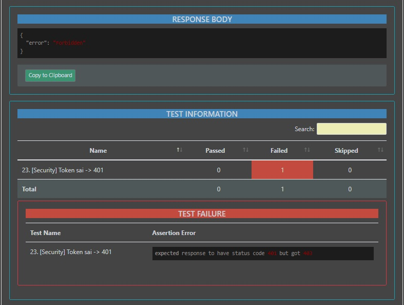

---

## II. BUGS TRONG CHỨC NĂNG FR-07: GIỎ HÀNG (POST /api/cart)

### Bug 8: Lỗ hổng thao túng giá tiền sản phẩm từ phía Client (Client-Side Price Manipulation)
- **Mô tả Bug:** API `POST /api/cart` cho phép client tự gửi giá tiền (`"price": 1`) và server tin tưởng lưu trực tiếp mức giá này vào cơ sở dữ liệu giỏ hàng thay vì tự truy vấn giá gốc từ bảng Products. Khi kiểm tra qua `GET /api/cart`, sản phẩm bị gán giá 1đ. Đây là lỗ hổng gian lận thương mại nghiêm trọng dẫn đến thiệt hại doanh thu trực tiếp.
- **Test Case liên quan:** Test E2: `[Security] Hack giá trị đơn hàng (Cố tình gửi price = 1) -> Server xử lý an toàn`
- **Endpoint:** `POST /api/cart`
- **Severity:** Critical
- **Github Issues Link:** https://github.com/Pipi1225/HW06-KiemThu/issues/8
- **Screenshot:**

  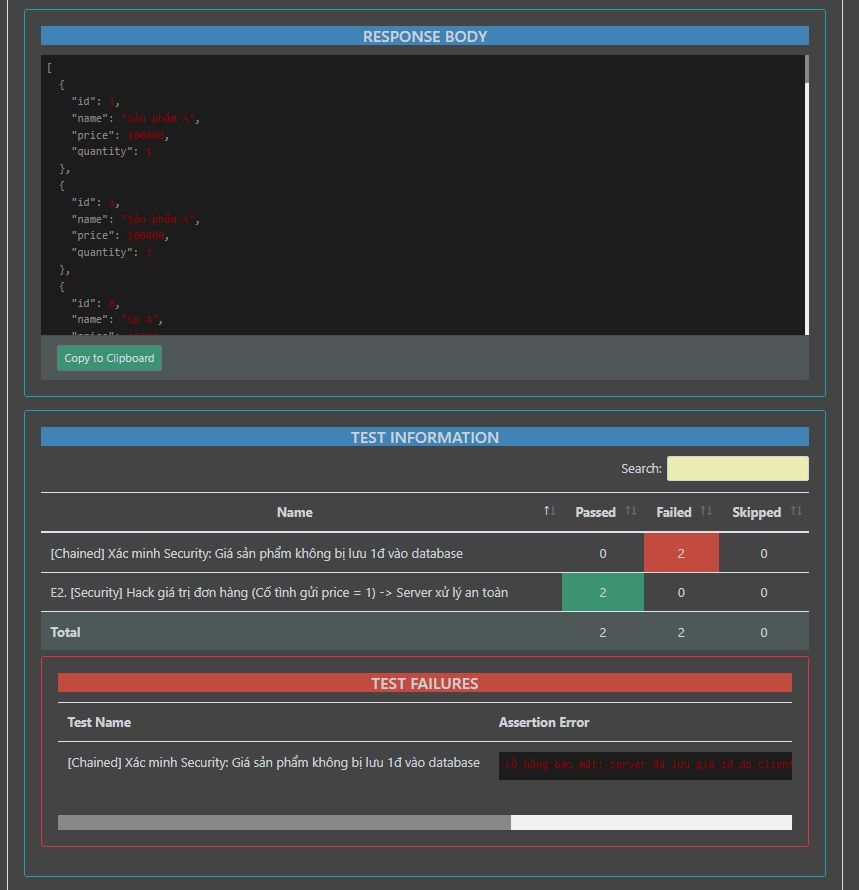

### Bug 9: Cho phép thêm sản phẩm với Số lượng không hợp lệ (Số âm, 0, số thập phân, null)
- **Mô tả Bug:** API không thực hiện kiểm tra tính hợp lệ của trường `quantity`. Người dùng có thể truyền `quantity = 0`, `quantity = -1` (số âm), `quantity = 1.5` (số thập phân) hoặc `quantity = null` mà server vẫn chấp nhận và phản hồi `200 OK Added to cart`. Lỗ hổng số lượng âm có thể bị khai thác để trừ bớt tổng tiền thanh toán của giỏ hàng.
- **Test Case liên quan:** Test 23, 24, 25, 27
- **Endpoint:** `POST /api/cart`
- **Severity:** High
- **Github Issues Link:** https://github.com/Pipi1225/HW06-KiemThu/issues/9
- **Screenshot:**

  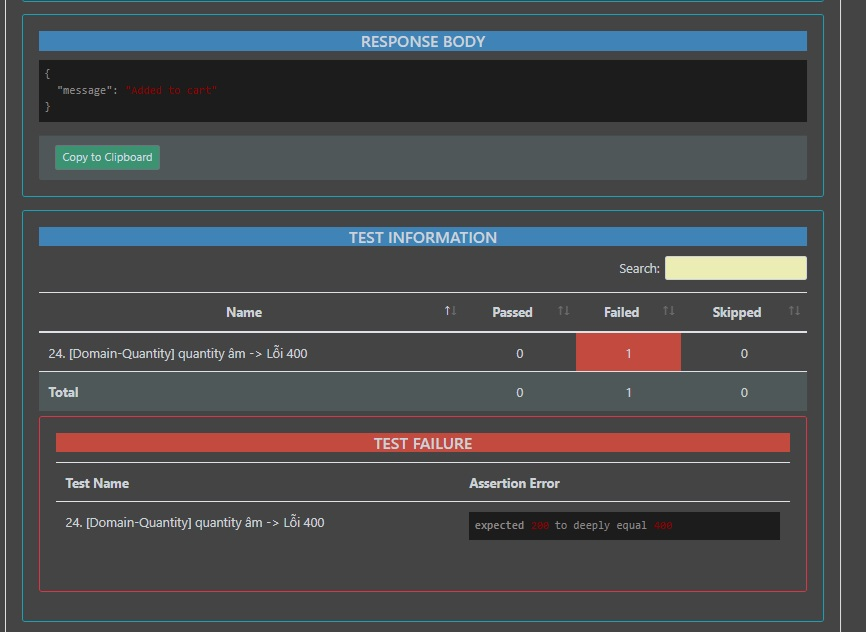

### Bug 10: Cho phép thêm sản phẩm với Giá tiền âm (Negative Price Allowed)
- **Mô tả Bug:** API chấp nhận trường `price = -1000` trong request body và trả về `200 OK Added to cart` thay vì từ chối dữ liệu giá tiền không hợp lệ bằng mã lỗi HTTP 400 Bad Request.
- **Test Case liên quan:** Test 18: `[Domain-Price] price âm -> Lỗi 400`
- **Endpoint:** `POST /api/cart`
- **Severity:** High
- **Github Issues Link:** https://github.com/Pipi1225/HW06-KiemThu/issues/10
- **Screenshot:**

  

### Bug 11: Thiếu ràng buộc toàn vẹn tham chiếu cho trường ID sản phẩm (Foreign Key Integrity)
- **Mô tả Bug:** API không kiểm tra sự tồn tại của sản phẩm trong CSDL trước khi thêm vào giỏ. Khi truyền `id = 0`, `id = -1`, `id = 1.5`, `id = ""` hoặc `id = 999999` (ID không hề tồn tại trong hệ thống), server vẫn phản hồi `200 OK Added to cart` thay vì trả về lỗi 400 Bad Request hoặc 404 Not Found.
- **Test Case liên quan:** Test 3, 4, 5, 6, 7, 9, 10
- **Endpoint:** `POST /api/cart`
- **Severity:** High
- **Github Issues Link:** https://github.com/Pipi1225/HW06-KiemThu/issues/11
- **Screenshot:**

  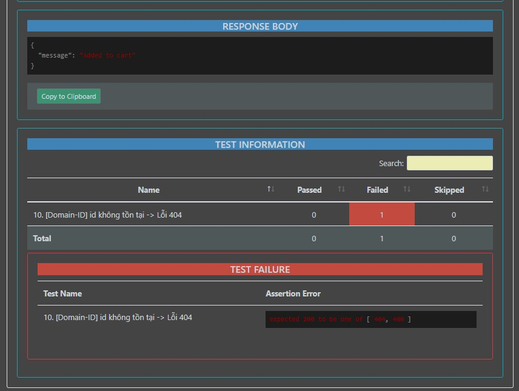

### Bug 12: Thiếu giới hạn trần số lượng mua tối đa (Uncapped Order Quantity / Business Logic Flaw)
- **Mô tả Bug:** Hệ thống cho phép người dùng thêm số lượng hàng cực lớn phi thực tế (`quantity = 999999`) vào giỏ hàng và phản hồi `200 OK`. Việc thiếu chặn trần số lượng mua (Order Purchase Limit) dẫn đến nguy cơ đầu cơ gom hàng ảo, khóa tồn kho bất hợp lý và gây lỗi tràn số khi tính toán tổng tiền đơn hàng.
- **Test Case liên quan:** Test E1: `[Business Logic] Mua vượt mức tồn kho / số lượng tối đa -> 400`
- **Endpoint:** `POST /api/cart`
- **Severity:** Medium
- **Github Issues Link:** https://github.com/Pipi1225/HW06-KiemThu/issues/12
- **Screenshot:**

  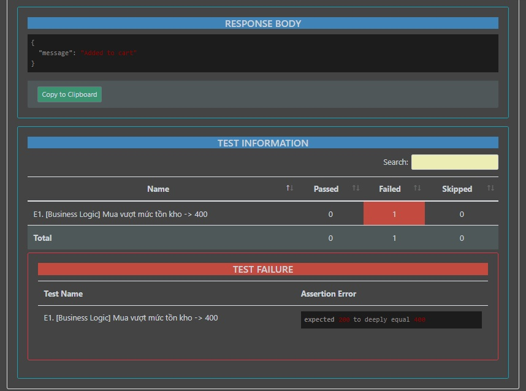

### Bug 13: Chấp nhận chuỗi SQL Injection trong trường ID sản phẩm
- **Mô tả Bug:** Khi truyền payload SQL Injection vào trường `id` (`{"id": "1 OR 1=1"}`), API không kiểm tra kiểu dữ liệu số nguyên và không từ chối request mà vẫn trả về HTTP 200 OK thay vì ném lỗi HTTP 400 Bad Request.
- **Test Case liên quan:** Test 33: `[Security-SQLi] SQLi ID -> Chặn an toàn`
- **Endpoint:** `POST /api/cart`
- **Severity:** Medium
- **Github Issues Link:** https://github.com/Pipi1225/HW06-KiemThu/issues/13
- **Screenshot:**

  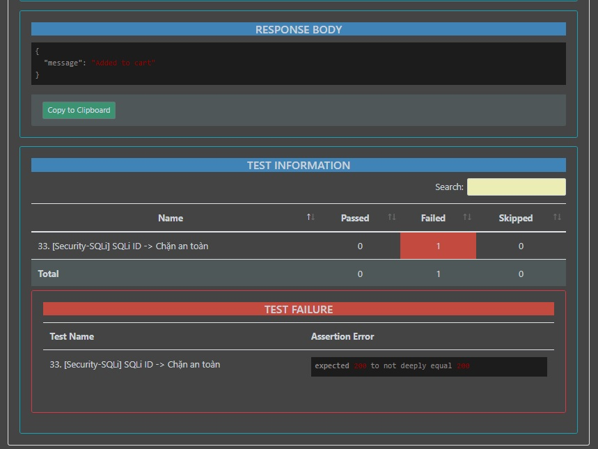

### Bug 14: Thiếu Validation giới hạn độ dài cho trường Name sản phẩm
- **Mô tả Bug:** Khi truyền tên sản phẩm `name` vượt quá 255 ký tự (chuỗi siêu dài), server không tiến hành cắt tỉa hoặc báo lỗi mà vẫn phản hồi `200 OK Added to cart`.
- **Test Case liên quan:** Test 12: `[Domain-Name] name quá dài -> Lỗi 400`
- **Endpoint:** `POST /api/cart`
- **Severity:** Low
- **Github Issues Link:** https://github.com/Pipi1225/HW06-KiemThu/issues/14
- **Screenshot:**

  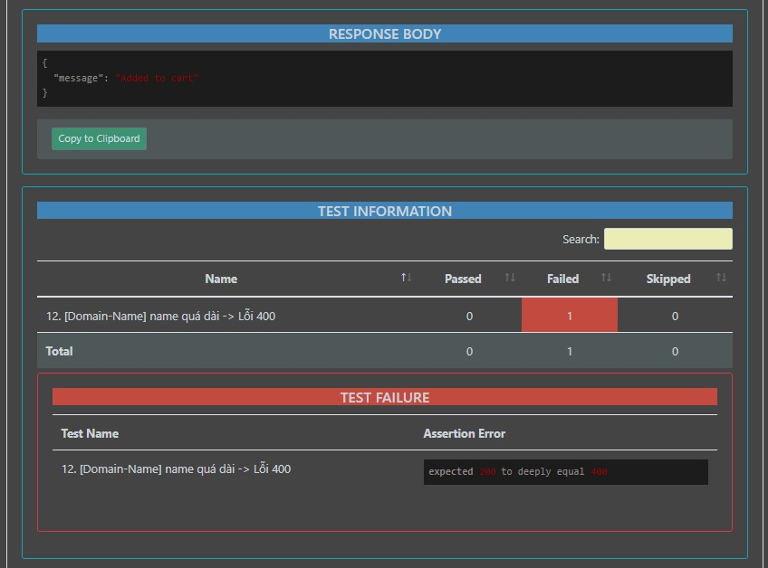 