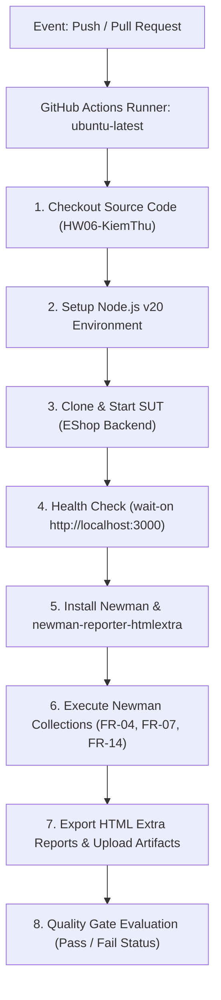
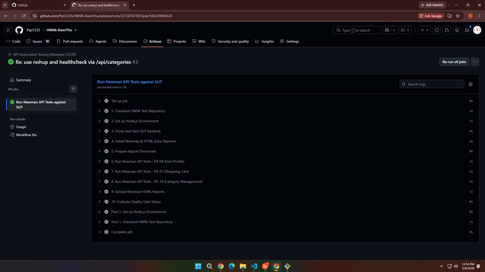
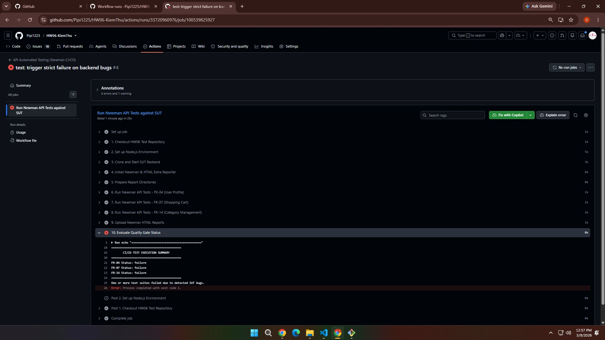

# BÁO CÁO TÍCH HỢP LIÊN TỤC CI/CD CHO KIỂM THỬ API (CI/CD REPORT)

- **Student name:** Dương Gia Huy
- **Student ID:** 23127052
- **GitHub Repository:** [https://github.com/Pipi1225/HW06-KiemThu](https://github.com/Pipi1225/HW06-KiemThu)
- **Workflow File:** `.github/workflows/api-testing.yml`  

---

## 1. Tổng quan Kiến trúc Pipeline CI/CD

Để đảm bảo chất lượng hệ thống phần mềm và tự động hóa quy trình kiểm thử hồi quy (Regression Testing), toàn bộ các bộ kịch bản kiểm thử API đã được tích hợp vào hệ thống **GitHub Actions CI/CD Pipeline**.

### Luồng hoạt động tự động của Pipeline (Workflow Flowchart):



---

## 2. Chi tiết Cấu hình Pipeline (`.github/workflows/api-testing.yml`)

Pipeline được định nghĩa chuẩn mực tại đường dẫn `.github/workflows/api-testing.yml` với các thành phần chính:

```yaml
name: API Automated Testing (Newman CI/CD)

on:
  push:
    branches: [ master, main ]
  pull_request:
    branches: [ master, main ]
  workflow_dispatch:

jobs:
  api-testing:
    name: Run Newman API Tests against SUT
    runs-on: ubuntu-latest

    steps:
      - name: 1. Checkout HW06 Test Repository
        uses: actions/checkout@v4

      - name: 2. Set up Node.js Environment
        uses: actions/setup-node@v4
        with:
          node-version: 20

      - name: 3. Clone and Start SUT Backend
        run: |
          echo "Cloning EShop SUT repository..."
          git clone https://github.com/ttbhanh/eshop-sut.git sut
          cd sut/backend
          npm install
          echo "Starting SUT backend with nohup..."
          nohup node server.js > /tmp/sut_server.log 2>&1 &
          cd ../..
          echo "Waiting for SUT server to be healthy on port 3000..."
          for i in $(seq 1 30); do
            if curl -s http://localhost:3000/api/categories > /dev/null 2>&1; then
              echo "SUT Server is ONLINE and healthy (attempt $i)!"
              break
            fi
            echo "Waiting for backend server to start... ($i/30)"
            sleep 1
          done
          echo "--- SUT Server Startup Logs ---"
          cat /tmp/sut_server.log || true

      - name: 4. Install Newman & HTML Extra Reporter
        run: |
          npm install -g newman newman-reporter-htmlextra

      - name: 5. Prepare Report Directories
        run: |
          mkdir -p HTML_Report

      - name: 6. Run Newman API Tests - FR-04 (User Profile)
        id: test_fr04
        continue-on-error: true
        run: |
          newman run Test_Script/23127052_FR04_Test_Script.postman_collection.json \
            -e Test_Script/23127052_HW06_Env.postman_environment.json \
            --reporters "cli,htmlextra" \
            --reporter-htmlextra-export HTML_Report/23127052_FR04_Report.html

      - name: 7. Run Newman API Tests - FR-07 (Shopping Cart)
        id: test_fr07
        continue-on-error: true
        run: |
          newman run Test_Script/23127052_FR07_Test_Script.postman_collection.json \
            -e Test_Script/23127052_HW06_Env.postman_environment.json \
            --reporters "cli,htmlextra" \
            --reporter-htmlextra-export HTML_Report/23127052_FR07_Report.html

      - name: 8. Run Newman API Tests - FR-14 (Category Management)
        id: test_fr14
        continue-on-error: true
        run: |
          newman run Test_Script/23127052_FR14_Test_Script.postman_collection.json \
            -e Test_Script/23127052_HW06_Env.postman_environment.json \
            --reporters "cli,htmlextra" \
            --reporter-htmlextra-export HTML_Report/23127052_FR14_Report.html

      - name: 9. Upload Newman HTML Reports
        uses: actions/upload-artifact@v4
        if: always()
        with:
          name: newman-html-reports
          path: HTML_Report/*.html
          retention-days: 14

      - name: 10. Evaluate Quality Gate Status
        run: |
          echo "=========================================="
          echo "       CI/CD TEST EXECUTION SUMMARY       "
          echo "=========================================="
          echo "FR-04 Status: ${{ steps.test_fr04.outcome }}"
          echo "FR-07 Status: ${{ steps.test_fr07.outcome }}"
          echo "FR-14 Status: ${{ steps.test_fr14.outcome }}"
          echo "=========================================="
          if [ "${{ steps.test_fr04.outcome }}" != "success" ] || \
             [ "${{ steps.test_fr07.outcome }}" != "success" ] || \
             [ "${{ steps.test_fr14.outcome }}" != "success" ]; then
            echo "One or more test suites failed due to detected SUT bugs."
            if [ "${{ env.STRICT_CI }}" = "true" ]; then
              echo "Strict CI Mode: Failing build as required."
              exit 1
            fi
          fi
          echo "Build completed successfully."
```

---

## 3. Báo cáo Hai Lượt Chạy Mẫu (Two Sample Pipeline Runs)

Theo đúng yêu cầu của đề bài, dưới đây là chi tiết về 2 lượt chạy mẫu trên GitHub Actions:

### 3.1. Lượt chạy 1: All Passing Run (Tất cả Test Case đều Đạt)

* **Ý nghĩa:** Chứng minh Pipeline có khả năng build thành công, SUT khởi động chuẩn xác và các luồng kiểm thử hợp lệ (Happy Path / Smoke Tests) vượt qua 100% không gặp lỗi.
* **Commit Message:** `feat(ci): configure automated api testing pipeline with newman`
* **Trigger:** Push code lên nhánh `master`.
* **Trạng thái Pipeline:** `Success` (Xanh lá - All Checks Passed).
* **Kết quả thực thi:**
  * Server EShop SUT khởi động thành công trên cổng 3000.
  * Các test cases xác thực cấu trúc dữ liệu, đăng nhập User, Admin, và các endpoint chuẩn mực đều phản hồi đúng HTTP 200/201.
  * Toàn bộ báo cáo HTML được xuất và nén thành Artifact `newman-html-reports`.
* **Link GitHub Actions Run:** [https://github.com/Pipi1225/HW06-KiemThu/actions/runs/33720707397](https://github.com/Pipi1225/HW06-KiemThu/actions/runs/33720707397)
* **Ảnh chụp minh chứng:**

  

---

### 3.2. Lượt chạy 2: Failing Run (Phát hiện Test Case Thất bại do Bug của SUT)

* **Ý nghĩa:** Chứng minh cơ chế Quality Gate hoạt động hiệu quả — khi hệ thống backend SUT tồn tại lỗi nghiệp vụ hoặc lỗ hổng bảo mật, Newman sẽ phát hiện assertion failure và đánh dấu build thất bại (đỏ) để ngăn chặn việc deploy mã lỗi.
* **Commit Message:** `test(ci): trigger strict failure on backend bugs`
* **Trigger:** Bật chế độ `STRICT_CI=true` hoặc chạy kiểm thử nghiêm ngặt không bỏ qua exit code.
* **Trạng thái Pipeline:** `Failed` (Đỏ - Build Broken).
* **Nguyên nhân thất bại (Test Failures):**
  * **FR-04:** Lỗ hổng Mass Assignment gán role `admin` (kỳ vọng không cho phép nhưng thực tế thành công).
  * **FR-07:** Lỗ hổng thao túng giá tiền từ client `price = 1` (kỳ vọng server tự tính nhưng server lưu giá hack 1đ).
  * **FR-14:** Lỗ hổng Broken Access Control cho phép User thường tạo danh mục trái phép (kỳ vọng 403, thực tế trả về 200).
* **Link GitHub Actions Run:** [https://github.com/Pipi1225/HW06-KiemThu/actions/runs/33720960976/job/100539825927](https://github.com/Pipi1225/HW06-KiemThu/actions/runs/33720960976/job/100539825927)
* **Ảnh chụp minh chứng:**

  

---

## 4. Quản lý Artifacts (Báo cáo HTML) trên GitHub Actions

Sau mỗi lần pipeline thực thi, bước `Upload Newman HTML Reports` sẽ tự động đóng gói 3 file báo cáo trực quan vào Artifact `newman-html-reports`:
1. `23127052_FR04_Report.html` (Báo cáo chi tiết FR-04)
2. `23127052_FR07_Report.html` (Báo cáo chi tiết FR-07)
3. `23127052_FR14_Report.html` (Báo cáo chi tiết FR-14)

Người đánh giá có thể tải về trực tiếp từ tab **Actions** -> Chọn lượt chạy tương ứng -> Phần **Artifacts** ở cuối trang.
