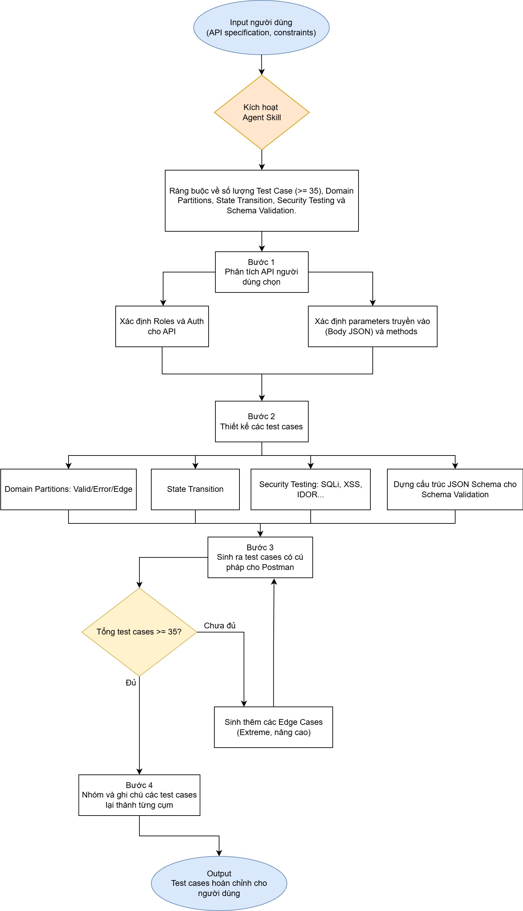
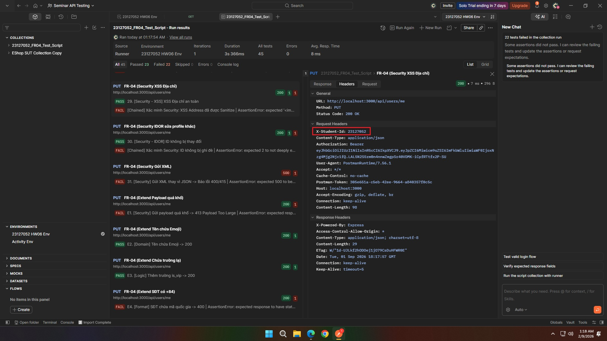
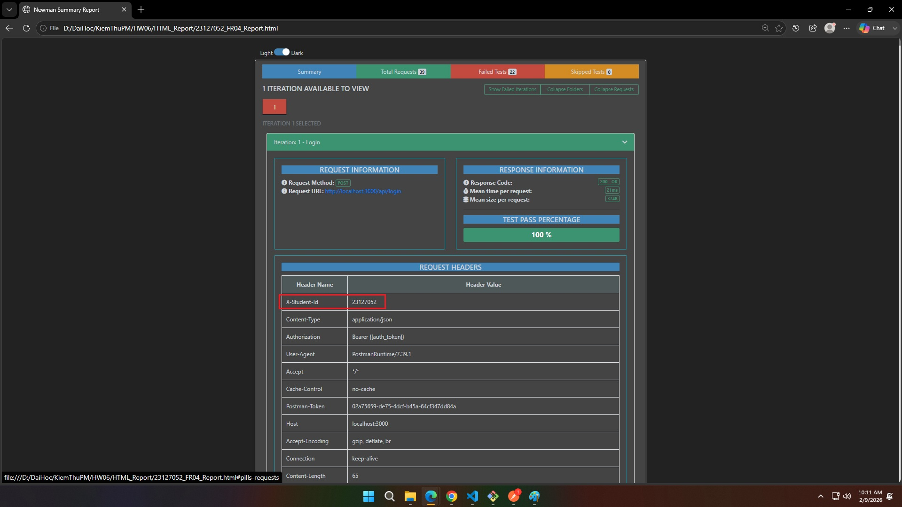
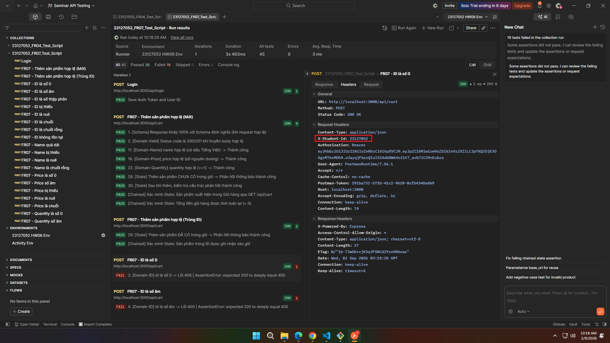
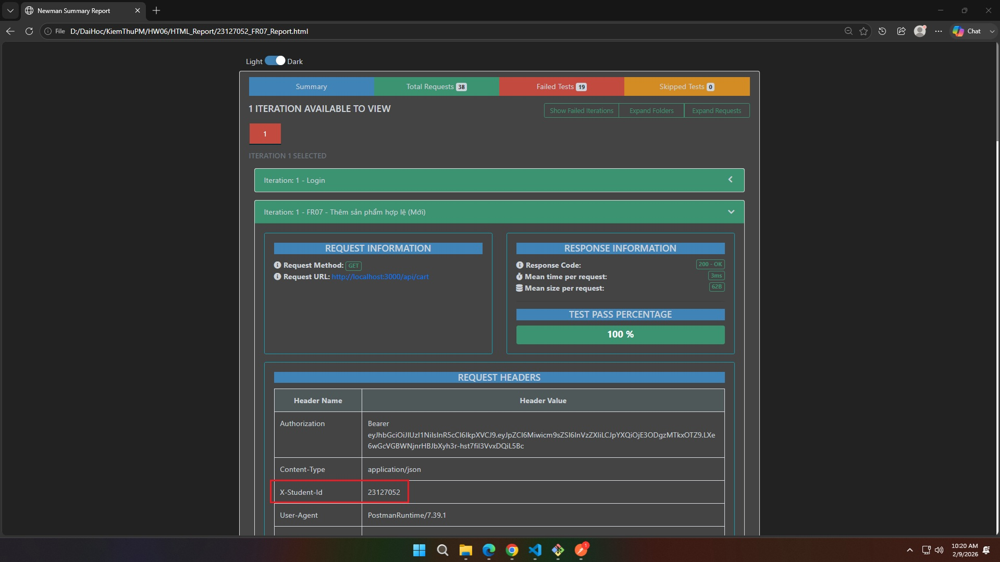
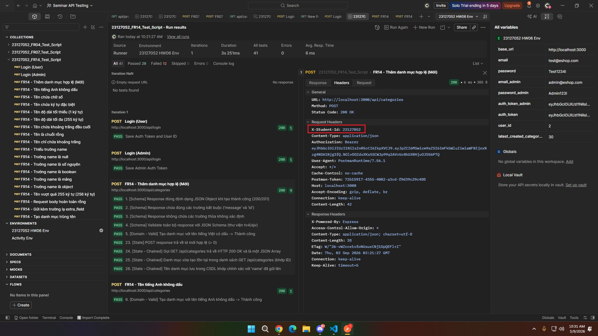
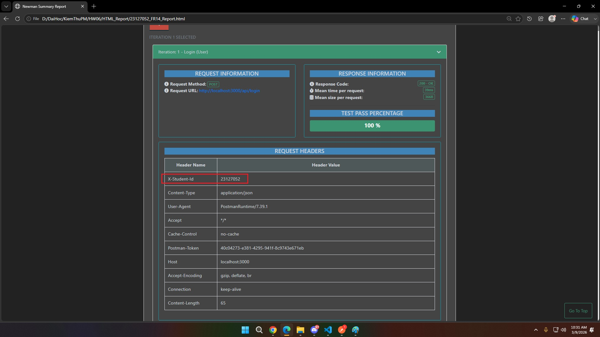

# HW06: API Testing

- **Student name**: Dương Gia Huy
- **Student ID**: 23127052

---

## AI Agent Skill

### 1. AI Agent Skill Flow Diagram



### 2. Pseudocode Quy Trình Hoạt Động (Agent Skill Workflow Pseudocode)

```text
ALGORITHM PostmanTestGeneratorAgent(api_spec, security_guidelines, target_min_tests = 35)
    INPUT:
        api_spec: OpenAPI spec hoặc Markdown đặc tả (Endpoint, Method, Request Body, Responses)
        security_guidelines: Danh sách vector kiểm thử bảo mật chuẩn (SEC-01 đến SEC-07)
        target_min_tests: Ngưỡng số lượng test case tối thiểu (Mặc định = 35)
    OUTPUT:
        postman_script: Mã kịch bản JavaScript chạy trong tab Tests của Postman

    // BƯỚC 1: Tiếp nhận và phân tích cú pháp đặc tả API
    endpoint, method   ← ExtractEndpointAndMethod(api_spec)
    request_schema     ← ExtractRequestBodySchema(api_spec)
    params             ← ExtractPathAndQueryParams(api_spec)
    expected_responses ← ExtractExpectedResponses(api_spec)
    test_suite         ← EmptyList()

    // BƯỚC 2: Phân bổ hạn ngạch (Quota Allocation) cho 4 khía cạnh
    quota_schema   ← Max(4,  Round(target_min_tests * 0.10))   // ~10% (>= 4 TCs)
    quota_domain   ← Max(18, Round(target_min_tests * 0.50))   // ~50% (>= 18 TCs)
    quota_state    ← Max(6,  Round(target_min_tests * 0.15))   // ~15% (>= 6 TCs)
    quota_security ← Max(7,  Round(target_min_tests * 0.25))   // ~25% (>= 7 TCs)

    // BƯỚC 3: Sinh test case theo từng chiều chuyên môn
    // 3.1. Schema Validation (tv4 / JSON Schema, Object Type, Required Fields)
    test_suite.Append(GenerateSchemaTests(expected_responses.schema, count=quota_schema))

    // 3.2. Domain Partitions (Valid, Boundary min/max, Empty, Whitespace, Null, Missing, Type Mismatch)
    FOREACH field IN request_schema.fields DO:
        test_suite.Append(GenerateDomainTests(field, request_schema))
    END FOREACH

    // 3.3. State Transitions (Xác minh tính bền vững dữ liệu bằng API Chaining qua pm.sendRequest)
    IF method IN ["POST", "PUT", "DELETE"] THEN:
        read_endpoint ← ResolveReadEndpoint(endpoint)
        test_suite.Append(GenerateChainedStateTests(read_endpoint, headers={"X-Student-Id": "23127052"}))
    END IF

    // 3.4. Security Checks (SEC-01..07: Auth token, SQLi, XSS, Role Escalation, IDOR, XML injection)
    test_suite.Append(GenerateSecurityTests(security_guidelines, count=quota_security))

    // BƯỚC 4: Quality Gate & Vòng lặp tự hoàn thiện
    WHILE Length(test_suite) < target_min_tests DO:
        corner_case ← SynthesizeEdgeCase(request_schema, endpoint)
        test_suite.Append(corner_case)
    END WHILE

    ValidateJavascriptSyntax(test_suite)
    EnsureRequiredHeaders(test_suite, header_name="X-Student-Id", student_id="23127052")

    // BƯỚC 5: Đóng gói và định dạng mã nguồn Postman
    postman_script ← FormatAsCategorizedJavascript(test_suite)
    RETURN postman_script
END ALGORITHM
```

## 1. AI-Generated Test Script
### 1.1. FR-04: Quản lý hồ sơ cá nhân
*   **API Endpoint sử dụng:** PUT /api/users/me
*   **Các Test Case do AI generated:**

| No. | Tựa đề | Nội dung | Status | Reasoning |
|---|---|---|---|---|
| 1 | [Schema] Response đúng định dạng JSON object | Kiểm tra response body phải là một JSON object. | VALID | Phù hợp với đặc tả trả về chuẩn RESTful. |
| 2 | [Schema] Response chứa message | Kiểm tra JSON trả về có trường message báo 'Profile updated'. | VALID | Phù hợp với phản hồi thực tế của server. |
| 3 | [Schema] User object khớp đặc tả | Kiểm tra user object có `id`, `name`, `email`, `role`. | INVALID | Đặc tả API không yêu cầu trả về user object và response thực tế chỉ trả về {"message": "Profile updated"}. Test case do AI tự suy đoán sai cấu trúc response nên bị loại bỏ. |
| 4 | [Schema] Validation với tv4/ajv | Dùng thư viện schema validator để đối chiếu JSON. | VALID | Phương pháp test tự động tốt nhất cho Schema. |
| 5 | [Domain - Valid] SĐT 10 số hợp lệ | Truyền SĐT 10 số (VD: 0912345678) -> Expect 200 OK. | VALID | Đáp ứng đúng Business Rule về số điện thoại ở Việt Nam. |
| 6 | [Domain - Valid] SĐT 11 số hợp lệ | Truyền SĐT 11 số (VD: 01234567890) -> Expect 200 OK. | VALID | Test case biên hợp lệ (độ dài tối đa của SĐT). |
| 7 | [Domain - Valid] Tên chứa khoảng trắng | Truyền Tên bình thường hợp lệ -> Expect 200 OK. | VALID | Phù hợp với dữ liệu tên thật trong thực tế. |
| 8 | [Domain - Valid] Tên dài tối đa 255 ký tự | Truyền Tên dài đúng 255 ký tự -> Expect 200 OK. | VALID | Test case biên hợp lệ (độ dài tối đa của Tên). |
| 9 | [Domain - Valid] Địa chỉ hợp lệ | Truyền Địa chỉ chứa chữ, số, dấu phẩy -> Expect 200 OK. | VALID | Dữ liệu phổ biến, đúng thực tế. |
| 10 | [Domain - Invalid] SĐT quá ngắn | Truyền SĐT 9 số -> Expect HTTP 400. | VALID | Test case Edge biên dưới (không hợp lệ) của SĐT. |
| 11 | [Domain - Invalid] SĐT quá dài | Truyền SĐT 12 số -> Expect HTTP 400. | VALID | Test case Edge biên trên (không hợp lệ) của SĐT. |
| 12 | [Domain - Invalid] SĐT không bắt đầu bằng số 0 | Truyền SĐT bắt đầu bằng số khác 0 -> Expect HTTP 400. | VALID | Vi phạm định dạng Prefix của số điện thoại. |
| 13 | [Domain - Invalid] SĐT chứa chữ cái | Truyền SĐT có ký tự a-z -> Expect HTTP 400. | VALID | Kiểm tra kiểu dữ liệu (chỉ cho phép số). |
| 14 | [Domain - Invalid] SĐT chứa ký tự đặc biệt | Truyền SĐT có dấu gạch ngang -> Expect HTTP 400. | VALID | Kiểm tra filter ký tự rác của hệ thống. |
| 15 | [Domain - Invalid] SĐT là chuỗi rỗng | Truyền SĐT "" -> Expect HTTP 400. | VALID | Kiểm tra validation `required` / `not empty`. |
| 16 | [Domain - Edge] SĐT là null | Truyền tham số phone = null -> Expect HTTP 400. | VALID | Test case Null value case. |
| 17 | [Domain - Invalid] Tên chuỗi rỗng | Truyền tên "" -> Expect HTTP 400. | VALID | Ràng buộc trong specs: Tên không được bỏ trống. |
| 18 | [Domain - Edge] Tên toàn khoảng trắng | Truyền tên "   " -> Expect HTTP 400. | VALID | Kiểm tra hàm `trim()` và validation của server. |
| 19 | [Domain - Edge] Tên quá 255 ký tự | Truyền tên 256 ký tự -> Expect HTTP 400. | VALID | Kiểm tra vi phạm giới hạn lưu trữ ở Database (Max length). |
| 20 | [Domain - Edge] Thiếu trường Name | Không gửi tham số name -> Expect HTTP 400. | VALID | Kiểm tra validation Missing Field trong Body. |
| 21 | [Domain - Invalid] Địa chỉ chuỗi rỗng | Truyền địa chỉ "" -> Expect HTTP 400. | INCOMPLETE | Trong đặc tả FR-04, địa chỉ là tham số optional (Rỗng thì vẫn có thể cập nhập được profile). |
| 22 | [Domain - Edge] Địa chỉ siêu dài (>1000 chars) | Truyền địa chỉ quá dài -> Expect HTTP 400/413. | VALID | Đảm bảo an toàn không bị tràn bộ nhớ/cơ sở dữ liệu. |
| 23 | [Security - SEC-02] Thiếu Authorization Header | Gửi request không có JWT -> Expect HTTP 401. | VALID | Yêu cầu bắt buộc của SEC-02 (Authentication). |
| 24 | [Security - SEC-02] JWT sai hoặc hết hạn | Gửi JWT token không hợp lệ -> Expect HTTP 401. | VALID | Kiểm tra logic verify Token của hệ thống. |
| 25 | [Security - SEC-06] Xử lý an toàn email | Cố tình truyền email mới -> DB không cập nhật email. | VALID | Do API chỉ trả về message success, cần phải gọi thêm API GET /users/me để xác minh data thật sự không bị đổi. |
| 26 | [Security - SEC-06] Xử lý an toàn role | Cố tình truyền role: admin -> Role vẫn là user. | VALID | Tương tự trên, cần gọi GET /users/me để xác minh quyền không bị leo thang (Privilege Escalation). |
| 27 | [Security - SQLi] Tấn công SQL Injection vào name | Truyền payload SQLi vào name -> Không sập DB. | VALID | Kiểm tra lỗ hổng Injection cơ bản. |
| 28 | [Security - SQLi] Tấn công SQL Injection vào phone | Truyền payload SQLi vào phone -> Lỗi 400. | VALID | Trường Phone chỉ nhận số, nếu nhập payload SQLi vào sẽ vướng format regex -> bắn ra lỗi 400. |
| 29 | [Security - XSS / SEC-04] Tấn công XSS vào name | Truyền `<script>` vào name -> Đã sanitize an toàn. | VALID | Kiểm tra lỗ hổng thực thi script (SEC-04). |
| 30 | [Security - XSS / SEC-04] Tấn công XSS vào địa chỉ | Truyền payload hình ảnh chứa mã XSS -> Xử lý an toàn. | VALID | Kiểm tra việc truyền XSS vector qua thẻ ``. |
| 31 | [Security - IDOR] Sửa profile user khác | Cố tình truyền id của người khác -> Chỉ cập nhật data của mình. | VALID | Do API chỉ trả về message success, cần gọi GET /users/me để xác minh ID không bị ghi đè. |
| 32 | [Security - ContentType] Gửi XML thay vì JSON | Sửa Content-Type thành XML -> Expect HTTP 400/415. | VALID | Server REST API chỉ nên chấp nhận `application/json`. |
| 33 | [State] Tên thay đổi thành công | Gọi API GET /users/me sau khi PUT để lấy Tên so sánh. | VALID | Do API chỉ trả về message, việc xác minh State phải phụ thuộc vào API lấy thông tin. |
| 34 | [State] SĐT thay đổi thành công | Gọi API GET /users/me sau khi PUT để lấy SĐT so sánh. | VALID | Tương tự trên. |
| 35 | [State] Địa chỉ thay đổi thành công | Gọi API GET /users/me sau khi PUT để lấy Địa chỉ so sánh. | VALID | Tương tự trên. |
| 36 | [Performance] Thời gian phản hồi < 1000ms | Expect API xử lý trong thời gian nhanh. | INVALID | Không có yêu cầu Non-functional về thời gian trong đặc tả nghiệp vụ. Và nếu đưa Test case này vào sẽ có khả năng gây ra Flaky Test trên CI/CD |
| 37 | [Workflow] Lưu biến môi trường | Đưa data response vào biến Postman để chuẩn bị verify. | VALID | Cần thiết để cho việc chạy Automation Test nối tiếp nhau tiện lợi hơn. |

### 1.2. FR-07: Giỏ hàng (Shopping Cart)
*   **API Endpoint sử dụng:** POST /api/cart
*   **Các Test Case do AI generated:**

| No. | Tựa đề | Nội dung | Status | Reasoning |
|---|---|---|---|---|
| 1 | [Schema] Response khớp 100% với Schema định nghĩa | Kiểm tra Schema của Response khi request thành công | VALID | Cần thiết để xác nhận cấu trúc JSON phản hồi (đặc biệt khi giỏ hàng là mảng các items). |
| 2 | [Domain - Valid] Status code là 200/201 khi truyền body hợp lệ | Truyền id = 1, quantity = 2 -> Expect 200/201 | VALID | Kiểm tra hành vi đúng của hệ thống (Happy path). |
| 3 | [Domain - ID] id là số 0 -> Lỗi (400 Bad Request) | Truyền id = 0 -> Expect 400 | VALID | Đảm bảo ID sản phẩm phải là số nguyên dương hợp lệ. |
| 4 | [Domain - ID] id là số âm (-1) -> Lỗi | Truyền id = -1 -> Expect 400 | VALID | Kiểm tra biên dưới của ID, chống dữ liệu rác. |
| 5 | [Domain - ID] id là số thập phân (1.5) -> Lỗi | Truyền id = 1.5 -> Expect 400 | VALID | Đảm bảo kiểu dữ liệu Integer cho ID Database. |
| 6 | [Domain - ID] id bị thiếu (missing) -> Lỗi | Không truyền thuộc tính id -> Expect 400 | VALID | Thiếu ID thì hệ thống không biết thêm sản phẩm nào. |
| 7 | [Domain - ID] id là null -> Lỗi | Truyền id = null -> Expect 400 | VALID | Ràng buộc giá trị Not Null. |
| 8 | [Domain - ID] id là chuỗi ('1') -> Không hợp lệ hoặc ép kiểu | Truyền id dạng chuỗi -> Expect xử lý an toàn | INCOMPLETE | Cần xác định rõ hệ thống ép kiểu (trả về 200) hay báo lỗi (400) để thiết lập Script chính xác. |
| 9 | [Domain - ID] id là chuỗi rỗng ('') -> Lỗi | Truyền id = "" -> Expect 400 | VALID | Bắt lỗi chuỗi rỗng của tham số bắt buộc. |
| 10 | [Domain - ID] id không tồn tại trong CSDL -> Lỗi 404 | Truyền id = 999999 -> Expect 404/400 | VALID | Đảm bảo ràng buộc toàn vẹn tham chiếu (Referential Integrity). |
| 11 | [Domain - Name] name hợp lệ (có dấu Tiếng Việt) -> Thành công | Truyền name = "Sản phẩm A" -> Expect 200/201 | VALID | Đảm bảo hệ thống xử lý đúng định dạng chuỗi UTF-8 theo như payload mẫu trong Đặc tả. |
| 12 | [Domain - Name] name quá dài (>255 ký tự) -> Lỗi 400 | Truyền chuỗi name > 255 ký tự -> Expect 400 | VALID | Kiểm tra giới hạn biên (Boundary) của chuỗi đầu vào theo chuẩn DB chung. |
| 13 | [Domain - Name] name bị thiếu (missing) -> Lỗi 400 | Không truyền thuộc tính name -> Expect 400 | VALID | Xác minh xem tham số name có bắt buộc theo Đặc tả hay không. |
| 14 | [Domain - Name] name là null -> Lỗi 400 | Truyền name = null -> Expect 400 | VALID | Xử lý lỗi khi truyền null vào trường chuỗi. |
| 15 | [Domain - Name] name là chuỗi rỗng ('') -> Lỗi 400 | Truyền name = "" -> Expect 400 | VALID | Xử lý lỗi khi truyền chuỗi rỗng. |
| 16 | [Domain - Price] price hợp lệ (số nguyên dương) -> Thành công | Truyền price = 100000 -> Expect 200/201 | VALID | Kiểm tra kiểu dữ liệu số nguyên dương theo Đặc tả. |
| 17 | [Domain - Price] price là số 0 -> Lỗi | Truyền price = 0 -> Expect 400 | VALID | Giá tiền thông thường phải > 0, kiểm tra biên dưới. |
| 18 | [Domain - Price] price là số âm (-1000) -> Lỗi | Truyền price = -1000 -> Expect 400 | VALID | Giá tiền không được âm, kiểm tra Validation của hệ thống. |
| 19 | [Domain - Price] price bị thiếu (missing) -> Lỗi 400 | Không truyền thuộc tính price -> Expect 400 | VALID | Xác minh xem tham số price có bắt buộc theo Đặc tả hay không. |
| 20 | [Domain - Price] price là null -> Lỗi 400 | Truyền price = null -> Expect 400 | VALID | Xử lý lỗi khi truyền null vào trường số. |
| 21 | [Domain - Price] price là chuỗi ('100000') -> Xử lý (ép kiểu hoặc lỗi) | Truyền price dạng chuỗi -> Expect xử lý an toàn | INCOMPLETE | Tương tự Test 8, cần xác định rõ hệ thống ép kiểu (trả về 200) hay báo lỗi (400) để thiết lập Script chính xác. |
| 22 | [Domain - Quantity] quantity hợp lệ (>=1) -> Thành công | Truyền quantity >= 1 -> Expect 200/201 | VALID | Đảm bảo tính hợp lệ của số lượng hàng vật lý. |
| 23 | [Domain - Quantity] quantity là số 0 -> Lỗi | Truyền quantity = 0 -> Expect 400 (Tối thiểu 1) | VALID | Nếu thêm 0 sản phẩm thì API phải từ chối. (Xóa thì dùng API khác). |
| 24 | [Domain - Quantity] quantity là số âm (-1) -> Lỗi | Truyền quantity = -1 -> Expect 400 | VALID | Ngăn chặn lỗ hổng Logic (Thêm số âm để làm giảm tổng tiền thanh toán). |
| 25 | [Domain - Quantity] quantity là số thập phân (1.5) -> Lỗi | Truyền quantity = 1.5 -> Expect 400 | VALID | Hàng hóa vật lý phải là số nguyên (Integer). |
| 26 | [Domain - Quantity] quantity bị thiếu (missing) -> Lỗi 400 | Không truyền thuộc tính quantity -> Expect 400 | INCOMPLETE | Nếu thiếu `quantity`, Backend có thể chủ động gán Default = 1 thay vì ném lỗi 400. Cần xác nhận Spec. |
| 27 | [Domain - Quantity] quantity là null -> Lỗi 400 | Truyền quantity = null -> Expect 400 | VALID | Bắt lỗi truyền null vào trường cần tính toán. |
| 28 | [State] Thêm sản phẩm CHƯA CÓ trong giỏ | Thêm sản phẩm mới -> Tạo dòng mới trong giỏ | VALID | Do POST chỉ trả về message, cần dùng API Chaining gọi GET /api/cart để xác minh sản phẩm đã lưu vào giỏ. |
| 29 | [State] Thêm sản phẩm ĐÃ CÓ trong giỏ | Thêm sản phẩm trùng -> Cộng dồn số lượng | VALID | Tương tự trên, cần gọi GET /api/cart để xác minh trạng thái giỏ hàng sau khi thêm trùng ID. |
| 30 | [State] Tổng tiền được tính toán lại | Xác minh Tổng cộng thay đổi đúng sau khi thêm | VALID | Do POST không trả về tổng tiền, dùng API Chaining gọi GET /api/cart để tính toán và xác minh tổng tiền > 0. |
| 31 | [Security-Auth] Không truyền Header Authorization | Gửi request không có token -> Expect 401 | VALID | Đảm bảo chỉ User đăng nhập mới thao tác được Cart. |
| 32 | [Security-Auth] Truyền Token không hợp lệ/hết hạn | Gửi request token sai -> Expect 401 | VALID | Xác minh tính an toàn của khâu Verify Token. |
| 33 | [Security-SQLi] SQL Injection ở id | Truyền id = "1 OR 1=1" -> Không sập DB | VALID | Kiểm thử lỗ hổng SQLi cơ bản. |
| 34 | [Security-XSS] XSS ở name | Truyền name = `<script>alert(1)</script>` -> Sanitize an toàn | VALID | Kiểm thử việc lưu mã độc vào tên sản phẩm. |
| 35 | [Security-IDOR] Thêm tham số lạ user_id | Chèn user_id của người khác vào payload -> Server bỏ qua | VALID | Chống lỗi BOLA: Không được phép thêm đồ vào giỏ của người khác. |

### 1.3. FR-14: Quản lý Danh mục (Category CRUD)
*   **API Endpoint sử dụng:** POST /api/categories
*   **Các Test Case do AI generated:**

| No. | Tựa đề | Nội dung | Status | Reasoning |
|---|---|---|---|---|
| 1 | [Schema] Response đúng định dạng JSON Object | Kiểm tra phản hồi trả về từ API phải là một JSON Object hợp lệ khi tạo thành công (HTTP 200/201). | VALID | Phù hợp với cấu trúc phản hồi chuẩn RESTful khi tạo mới tài nguyên thành công. |
| 2 | [Schema] Response chứa đúng các trường bắt buộc (`message`, `id`) | Kiểm tra response có thuộc tính `message` ("Category created") và `id` kiểu số nguyên dương. | VALID | Khớp chính xác với cấu trúc response thực tế của server eShop khi tạo category. |
| 3 | [Schema] Response không chứa các trường thừa không xác định | Kiểm tra response chỉ chứa chính xác 2 trường `message` và `id`, không rò rỉ dữ liệu nội bộ. | VALID | Kiểm tra an toàn Schema nhằm ngăn ngừa rò rỉ thông tin nội bộ (Information Disclosure). |
| 4 | [Schema] Validate toàn bộ response với JSON Schema (`tv4`/`ajv`) | Dùng thư viện schema validation của Postman để đối chiếu cấu trúc JSON response 100%. | VALID | Phương pháp chuẩn xác nhất trong kiểm thử tự động để xác minh toàn diện Schema. |
| 5 | [Domain - Valid] Tạo danh mục với tên tiếng Việt có dấu | Body `{"name": "Đồng hồ thông minh"}` -> Kỳ vọng HTTP 200/201 OK. | VALID | Đảm bảo hệ thống và cơ sở dữ liệu hỗ trợ tốt định dạng chuỗi ký tự UTF-8 có dấu. |
| 6 | [Domain - Valid] Tạo danh mục với tên tiếng Anh không dấu | Body `{"name": "Smart Watch"}` -> Kỳ vọng HTTP 200/201 OK. | VALID | Kịch bản dữ liệu thông thường (Happy Path) với bảng mã ASCII chuẩn. |
| 7 | [Domain - Valid] Tạo danh mục với tên chứa chữ số | Body `{"name": "iPhone 15 Series"}` -> Kỳ vọng HTTP 200/201 OK. | VALID | Tên danh mục công nghệ thực tế thường chứa cả chữ và số. |
| 8 | [Domain - Valid] Tên chứa ký tự đặc biệt thông dụng (`&`, `-`, `/`) | Body `{"name": "Âm thanh & Phụ kiện"}` -> Kỳ vọng HTTP 200/201 OK. | VALID | Ký tự liên kết ngành hàng phổ biến trong hệ thống thương mại điện tử. |
| 9 | [Domain - Valid] Tên đạt độ dài tối thiểu (1 ký tự) | Body `{"name": "A"}` -> Kỳ vọng HTTP 200/201 OK. | VALID | Kiểm tra giá trị biên dưới hợp lệ (Boundary) của độ dài tên danh mục. |
| 10 | [Domain - Valid] Tên đạt độ dài tối đa hợp lệ (255 ký tự) | Body `{"name": "a".repeat(255)}` -> Kỳ vọng HTTP 200/201 OK. | VALID | Kiểm tra giá trị biên trên hợp lệ theo chuẩn độ dài chuỗi VARCHAR(255) trong CSDL. |
| 11 | [Domain - Valid] Tên chứa khoảng trắng ở đầu và cuối | Body `{"name": "  Máy tính bảng  "}` -> Kỳ vọng HTTP 200/201 OK, hệ thống tự động trim. | VALID | Kiểm tra khả năng tự động xử lý và làm sạch (trim) khoảng trắng thừa của hệ thống. |
| 12 | [Domain - Invalid] Tên danh mục là chuỗi rỗng (`""`) | Body `{"name": ""}` -> Kỳ vọng HTTP 400 Bad Request. | VALID | Ràng buộc FR-14 quy định tên danh mục là bắt buộc, không được để trống. |
| 13 | [Domain - Invalid] Tên danh mục chỉ chứa toàn khoảng trắng (`"   "`) | Body `{"name": "   "}` -> Kỳ vọng HTTP 400 Bad Request. | VALID | Sau khi trim khoảng trắng, chuỗi rỗng phải bị từ chối bằng lỗi 400. |
| 14 | [Domain - Invalid] Thiếu trường `name` trong request body | Body `{}` -> Kỳ vọng HTTP 400 Bad Request. | VALID | Kiểm tra validation thiếu trường bắt buộc (Missing Required Field). |
| 15 | [Domain - Invalid] Trường `name` có giá trị `null` | Body `{"name": null}` -> Kỳ vọng HTTP 400 Bad Request. | VALID | Ngăn chặn việc truyền giá trị null vào trường NOT NULL trong cơ sở dữ liệu. |
| 16 | [Domain - Invalid] Trường `name` có kiểu dữ liệu số nguyên (12345) | Body `{"name": 12345}` -> Xử lý an toàn (HTTP 400 hoặc ép kiểu chuỗi). | INCOMPLETE | Cần xác định rõ hành vi mong muốn là tự động ép kiểu thành chuỗi hay từ chối 400 để viết assertion chính xác. |
| 17 | [Domain - Invalid] Trường `name` có kiểu dữ liệu boolean (`true`) | Body `{"name": true}` -> Kỳ vọng HTTP 400 Bad Request. | VALID | Kiểm tra bắt lỗi vi phạm kiểu dữ liệu (Type Mismatch). |
| 18 | [Domain - Invalid] Trường `name` có kiểu dữ liệu mảng (`[]`) | Body `{"name": ["Thời trang"]}` -> Kỳ vọng HTTP 400 Bad Request. | VALID | Ngăn chặn việc truyền mảng vào trường lưu chuỗi đơn. |
| 19 | [Domain - Invalid] Trường `name` có kiểu dữ liệu object (`{}`) | Body `{"name": {"sub": "con"}}` -> Kỳ vọng HTTP 400 Bad Request. | VALID | Ngăn chặn việc truyền object lồng nhau gây lỗi phân tích cú pháp DTO. |
| 20 | [Domain - Invalid] Tên danh mục vượt quá độ dài tối đa (256 ký tự) | Body `{"name": "a".repeat(256)}` -> Kỳ vọng HTTP 400 Bad Request. | VALID | Kiểm tra giá trị biên ngoài không hợp lệ, chống tràn bộ nhớ lưu trữ CSDL. |
| 21 | [Domain - Edge] Request body hoàn toàn rỗng (Empty payload) | Raw body `""` -> Kỳ vọng HTTP 400 Bad Request. | VALID | Đảm bảo server xử lý an toàn khi client gửi payload rỗng mà không bị crash. |
| 22 | [Domain - Edge] Gửi kèm trường không xác định ngoài `name` | Body `{"name": "Gia dụng", "extra_field": "test"}` -> Xử lý an toàn (bỏ qua hoặc 400). | VALID | Kiểm tra tính an toàn khi nhận trường lạ (DTO Pollution / Extra Fields Handling). |
| 23 | [State] POST response trả về `id` mới hợp lệ (> 0) | Xác nhận `id` trả về là số nguyên dương và lưu vào biến môi trường `latest_created_category_id`. | VALID | Cần thiết để kiểm tra ID tự tăng và phục vụ kịch bản API Chaining tiếp theo. |
| 24 | [State - Chained] Gọi `GET /api/categories` trả về HTTP 200 OK | Gửi request `GET /api/categories` qua `pm.sendRequest` để đọc danh sách danh mục hiện tại. | VALID | Bước khởi tạo API Chaining để xác minh tính nhất quán của trạng thái hệ thống. |
| 25 | [State - Chained] Danh mục vừa tạo xuất hiện trong `GET /api/categories` | Tìm kiếm trong mảng danh mục có phần tử thỏa mãn `item.id === createdId`. | VALID | Xác nhận danh mục mới đã thực sự được lưu bền vững (Persistent) vào CSDL. |
| 26 | [State - Chained] Tên danh mục trong CSDL khớp với `name` đã gửi | Đối chiếu `foundCategory.name` trả về từ GET với `reqBody.name` gửi lên trong POST. | VALID | Đảm bảo tính toàn vẹn của dữ liệu sau khi ghi, không bị biến dạng hoặc cắt cụt. |
| 27 | [State - Chained] Mọi danh mục trong danh sách đều có cấu trúc `{id, name}` | Duyệt qua mảng kết quả của GET và kiểm tra từng item đều có đầy đủ `id` và `name`. | INVALID | Kiểm tra toàn bộ danh mục của API GET không thuộc phạm vi của kịch bản POST này, dễ gây Flaky Test nếu data cũ có lỗi. |
| 28 | [State] Xử lý khi tạo danh mục trùng tên đã tồn tại | Gửi tên trùng với danh mục đã có trong hệ thống -> Kiểm tra phản hồi (200/201/409). | INCOMPLETE | Đặc tả chưa nêu rõ tên danh mục có bắt buộc Unique hay không, cần làm rõ nghiệp vụ để set mã lỗi 409 hoặc chấp nhận 200/201. |
| 29 | [Security - SEC-02] Không gửi Authorization Header -> Bị từ chối 401 | Gửi request không có token -> Kỳ vọng HTTP 401 Unauthorized. | VALID | Tuân thủ yêu cầu xác thực bắt buộc của SEC-02 và FR-12. |
| 30 | [Security - SEC-02] Gửi Token không hợp lệ hoặc hết hạn -> Bị từ chối 401 | Gửi `Authorization: Bearer INVALID_TOKEN` -> Kỳ vọng HTTP 401 Unauthorized. | VALID | Kiểm tra cơ chế giải mã và xác minh tính hợp lệ của chữ ký JWT token. |
| 31 | [Security - SEC-03] Kiểm tra phân quyền Admin: User thường không được tạo danh mục -> Bị từ chối 403 | FR-12: Chỉ role Admin mới được tạo danh mục. Dùng token user thường (`test@eshop.com`) -> Kỳ vọng HTTP 403. | VALID | Kiểm thử phân quyền RBAC trọng yếu, đảm bảo chỉ có Admin mới được quản lý danh mục. |
| 32 | [Security - SEC-05 / SQLi] Tấn công SQL Injection vào trường `name` | Payload `{"name": "' OR 1=1 --"}` hoặc `DROP TABLE` -> Kỳ vọng không sập 500 DB. | VALID | Kiểm tra lỗ hổng Injection cơ bản nhằm đảm bảo an toàn truy vấn cơ sở dữ liệu. |
| 33 | [Security - SEC-04 / XSS] Tấn công Stored XSS vào trường `name` | Payload `{"name": "<script>alert('XSS')</script>"}` -> Không crash 500, sanitize an toàn khi đọc lại. | VALID | Kiểm tra tính năng làm sạch (Sanitize) mã độc script trước khi lưu vào hệ thống. |
| 34 | [Security - IDOR / Tampering] Client tự ý chỉ định trường `id` trong body | Body `{"name": "Test", "id": 9999}` -> Server tự sinh ID, không cho phép ghi đè ID theo ý client. | VALID | Chống lỗi ID Tampering, đảm bảo khóa chính ID do database tự động quản lý. |
| 35 | [Security - Content-Type] Gửi payload dạng XML / Text thay vì JSON | Đặt header `Content-Type: application/xml` -> Kỳ vọng HTTP 400 hoặc 415 Unsupported Media Type. | VALID | Đảm bảo máy chủ REST API chỉ chấp nhận định dạng `application/json` chuẩn. |

## 2. Extend Test Script
### 2.1. FR-04: Quản lý hồ sơ cá nhân

| No. | Tựa đề | Nội dung / Kịch bản test | Reasoning |
|---|---|---|---|
| E1 | [Security] Gửi payload lớn (DoS) | Truyền chuỗi rất lớn (vài Megabytes) vào trường name/address -> Expect HTTP 413 Payload Too Large. | Kịch bản AI chưa có case tấn công cạn kiệt tài nguyên máy chủ. |
| E2 | [Domain] Tên chứa ký tự Unicode/Emoji | Truyền Tên "Nguyễn Văn A 🧑‍💻" -> Expect 200 OK. | Đảm bảo hệ thống và Database hỗ trợ mã hóa UTF-8 đầy đủ. |
| E3 | [Business Logic] Payload chứa trường không xác định | Thêm tham số `is_vip: true` vào JSON request -> Expect 200 OK. | Kiểm tra tính an toàn của API khi nhận DTO rác (server phải tự động bỏ qua trường lạ). |
| E4 | [Format] Số điện thoại chứa mã quốc gia | Truyền SĐT dạng `+84912345678` thay vì `09...` -> Expect HTTP 400. | Đặc tả ghi rõ số điện thoại nhập phải bắt đầu bằng số 0, kịch bản cũ chưa bao phủ case có dấu `+`. |
| E5 | [Method] Gửi sai HTTP Method | Gửi request update bằng phương thức `POST` thay vì `PUT` -> Expect HTTP 405 Method Not Allowed. | Test cases do AI sinh ra chỉ gắn với method PUT, cần mở rộng thêm qua bằng method POST để phủ tốt hơn nữa. |

#### Lý do AI bỏ sót:
- Prompt chỉ cung cấp danh sách các trường có trong schema JSON, không đề cập đến giới hạn cấu hình web server (như body limit) và không yêu cầu kiểm tra trường lạ ngoài schema (`is_vip`), nên AI chỉ sinh test bám sát các trường được khai báo.
- AI tập trung vào logic controller của method PUT mà bỏ qua tầng định tuyến mạng (gọi sai method bị 405). Ngoài ra, AI xem mọi văn bản đều là chuỗi ký tự nên bỏ sót kiểm tra mã hóa ký tự đặc biệt.
- API thực tế chỉ trả về `{"message": "Profile updated"}` thay vì toàn bộ dữ liệu người dùng, phản hồi tối giản khiến AI khó nhận diện các nguy cơ quá tải payload hoặc định dạng SĐT quốc tế.

---

### 2.2. FR-07: Giỏ hàng (Shopping Cart)

| No. | Tựa đề | Nội dung / Kịch bản test | Reasoning |
|---|---|---|---|
| E1 | [Business Logic] Mua vượt mức tồn kho (Out of stock) | Truyền quantity = 999999 -> Expect HTTP 400. | Kịch bản AI chưa phân tích đến giới hạn vật lý của kho hàng (Không thể bán thứ mình không có). |
| E2 | [Security] Hack giá trị đơn hàng (Cố tình thay đổi price) | Cố tình truyền `price = 1` -> Expect 200, nhưng Backend vẫn phải tính tổng tiền dựa trên giá gốc trong CSDL. | Bắt được lỗ hổng E-commerce chí mạng: Client truyền giá bao nhiêu Server tin bấy nhiêu. |
| E3 | [Method] Gửi sai HTTP Method | Sử dụng GET hoặc PUT thay vì POST -> Expect HTTP 405 Method Not Allowed. | API Test cần bao phủ cả các trường hợp request bị chặn ngay tại tầng Router. |
| E4 | [Security / Race Condition] Spam request đồng thời | Dùng Script bắn 2 request `Add to Cart` cùng một sản phẩm cách nhau chỉ 10ms -> Expect số lượng được cộng dồn chính xác. | Kịch bản chuyên sâu kiểm tra cơ chế khóa (Database Lock) của Server, ngăn lỗi Race Condition. |
| E5 | [State] Thêm sản phẩm đang bị khóa (Inactive) | Cố tình truyền `id` của một sản phẩm đã ngừng kinh doanh/bị ẩn -> Expect HTTP 400 / 403. | AI thường dựa trên cấu trúc dữ liệu mà bỏ qua các trạng thái (State) theo vòng đời của sản phẩm trong thực tế. |

#### Lý do AI bỏ sót:
- Prompt chỉ đưa schema độc lập của endpoint giỏ hàng mà không kèm bảng sản phẩm (giá gốc, tồn kho, trạng thái bán). Do schema mẫu có sẵn trường `price`, AI coi `price` là input hợp lệ thay vì nhận ra đây là lỗi thiết kế logic.
- AI chỉ kiểm thử tĩnh theo từng trường riêng lẻ, thiếu khả năng hình dung các tình huống chạy đồng thời (race condition) hoặc ràng buộc thực tế ngoài đời thực (không thể mua vượt tồn kho).
- Hành vi của API giỏ hàng phụ thuộc vào trạng thái của sản phẩm ở module khác (sản phẩm còn bán hay đã ẩn). AI kiểm thử black-box đơn lẻ trên một endpoint nên không bao quát được các trạng thái liên kết này.

---

### 2.3. FR-14: Quản lý Danh mục (Category CRUD)

| No. | Tựa đề | Nội dung / Kịch bản test | Reasoning |
|---|---|---|---|
| E1 | [Security] Gửi payload tên danh mục cực lớn (DoS) | Truyền chuỗi name vài Megabytes -> Expect HTTP 413 Payload Too Large. | Kiểm tra giới hạn buffer và dung lượng request body của web server, ngăn chặn DoS. |
| E2 | [Method] Gửi sai HTTP Method | Gửi request bằng method PUT hoặc PATCH tới /api/categories thay vì POST -> Expect HTTP 405 Method Not Allowed. | Kiểm tra tầng định tuyến router phản hồi đúng mã 405 khi gọi sai method trên collection endpoint. |
| E3 | [Security / Race Condition] Tạo đồng thời danh mục trùng tên | Bắn 2 request POST /api/categories cùng tên trong khoảng 10ms -> Expect xử lý tuần tự, không tạo 2 danh mục trùng lặp rác. | Kiểm tra cơ chế khóa CSDL (Database Lock) và tính nhất quán dữ liệu khi có tranh chấp đồng thời. |
| E4 | [Format] Tên chứa ký tự khoảng trắng tàng hình (Zero-width space) | Truyền tên danh mục chứa ký tự xuống dòng (\n) hoặc Zero-width space (\u200B) -> Expect HTTP 400 hoặc làm sạch an toàn. | Ngăn chặn kỹ thuật vượt mặt validation và lỗi vỡ layout hiển thị trên giao diện người dùng. |
| E5 | [State] Kiểm tra trạng thái mặc định của danh mục mới | Sau khi POST thành công, gọi GET /api/categories kiểm tra danh mục mới được tự động kích hoạt hiển thị (is_active: true). | Xác minh tính đúng đắn của vòng đời trạng thái dữ liệu mặc định mà đặc tả API không nêu chi tiết. |

#### Lý do AI bỏ sót:
- Prompt chỉ cung cấp schema cơ bản {"name": "Tên DM"} mà không đề cập đến cấu hình giới hạn kích thước request của server, ràng buộc tính duy nhất giữa các bản ghi và xử lý khoảng trắng nâng cao.
- AI chỉ kiểm thử tĩnh theo luồng tuần tự đơn lẻ nên bỏ sót các kịch bản chạy đồng thời (race condition khi tạo trùng tên), lỗi gọi sai HTTP method (405) và các ký tự đặc biệt tàng hình (zero-width space).
- API chỉ trả về phản hồi tối giản {"message": "Category created", "id": ...} mà không trả về toàn bộ thuộc tính, khiến AI không nhận biết được các giá trị mặc định và không kiểm tra được tính toàn vẹn trạng thái nếu không chủ động thiết kế API Chaining để verify sâu.

## 3. Execution of Test Script
Chi tiết phần kết quả của Test script của các FR nằm trong folder `HTML_Report`.

### 3.1. FR-04: Quản lý hồ sơ cá nhân



### 3.2. FR-07: Giỏ hàng (Shopping Cart)



### 3.3. FR-14: Quản lý Danh mục (Category CRUD)



## 4. Bug Found During Execution

Tổng hợp danh sách các lỗi phát hiện được trong quá trình thực thi kiểm thử tự động với Newman. Chi tiết các bước tái hiện và phân tích chuyên sâu được trình bày tại [Bug_Report.md](Bug_Report.md).

| Bug ID | Feature | Endpoint | Tóm tắt lỗi phát hiện | Test Case liên quan | Severity |
| :---: | :---: | :--- | :--- | :--- | :---: |
| **#1** | FR-04 | `PUT /api/users/me` | Leo thang đặc quyền (Privilege Escalation) qua Mass Assignment gán role admin | Test 25 | **Critical** |
| **#2** | FR-04 | `PUT /api/users/me` | Lỗ hổng Stored XSS trong Profile (Name & Address không sanitize thẻ script) | Test 28, 29 | **High** |
| **#3** | FR-04 | `PUT /api/users/me` | Lỗ hổng IDOR cho phép ghi đè/xung đột ID người dùng | Test 30 | **High** |
| **#4** | FR-04 | `PUT /api/users/me` | Crash 500 Internal Server Error khi gửi Content-Type dạng XML | Test 31 | **Medium** |
| **#5** | FR-04 | `PUT /api/users/me` | Thiếu validation định dạng Số điện thoại (chấp nhận rỗng, chữ, null, sai số) | Test 10–16, 27, E4 | **Medium** |
| **#6** | FR-04 | `PUT /api/users/me` | Thiếu validation trường Name (chấp nhận rỗng, khoảng trắng, vượt quá 255 ký tự) | Test 17–20 | **Medium** |
| **#7** | FR-04 | `PUT /api/users/me` | Trả về sai status code khi token lỗi (403 Forbidden thay vì 401 Unauthorized) | Test 23 | **Low** |
| **#8** | FR-07 | `POST /api/cart` | Thao túng giá tiền từ Client (Client-Side Price Tampering lưu giá 1đ) | Test E2 | **Critical** |
| **#9** | FR-07 | `POST /api/cart` | Cho phép thêm sản phẩm với số lượng không hợp lệ (số âm, 0, thập phân, null) | Test 23–25, 27 | **High** |
| **#10** | FR-07 | `POST /api/cart` | Cho phép thêm sản phẩm với giá tiền âm (`price = -1000`) | Test 18 | **High** |
| **#11** | FR-07 | `POST /api/cart` | Vi phạm toàn vẹn tham chiếu ID (chấp nhận ID rác, không tồn tại, số âm) | Test 3–7, 9, 10 | **High** |
| **#12** | FR-07 | `POST /api/cart` | Thiếu giới hạn trần số lượng mua (cho phép đặt số lượng phi lý 999,999) | Test E1 | **Medium** |
| **#13** | FR-07 | `POST /api/cart` | Chấp nhận chuỗi SQL Injection ở trường ID (`1 OR 1=1`) không ném lỗi 400 | Test 33 | **Medium** |
| **#14** | FR-07 | `POST /api/cart` | Thiếu validation độ dài tối đa cho trường Name sản phẩm (>255 ký tự) | Test 12 | **Low** |
| **#15** | FR-14 | `POST /api/categories` | Leo thang đặc quyền / BOLA: User thường tự ý gọi API Admin tạo Danh mục mới | Test 31 | **Critical** |
| **#16** | FR-14 | `POST /api/categories` | Thiếu toàn bộ validation cho trường Name danh mục (rỗng, space, null, mảng, >255) | Test 12–15, 17–21 | **High** |
| **#17** | FR-14 | `POST /api/categories` | Crash 500 Internal Server Error khi gửi Content-Type dạng XML | Test 35 | **Medium** |
| **#18** | FR-14 | `POST /api/categories` | Trả về sai HTTP status code khi gọi sai Method (404 Not Found thay vì 405) | Test E2 | **Low** |

## 5. Postman Features được sử dụng trong bài

Trong bài tập HW06, em đã vận dụng tối đa các tính năng cốt lõi và nâng cao của Postman để xây dựng bộ kịch bản kiểm thử API tự động, bao gồm:

1. **Workspaces & Collections Management:**
   - Tạo và phân bổ 3 Collections chuyên biệt tương ứng 3 module kiểm thử: FR-04 (`PUT /api/users/me`), FR-07 (`POST /api/cart`), và FR-14 (`POST /api/categories`).
   - Sắp xếp các request tuần tự: Đăng nhập cấp Token (`Login User`, `Login Admin`) -> Chạy kiểm thử chức năng -> API Chaining kiểm tra trạng thái CSDL.

2. **Environment & Global Variables (`pm.environment`):**
   - Quản lý tập trung các biến cấu hình qua file `23127052_HW06_Env.postman_environment.json`: `base_url`, `student_id` (`23127052`), `user_token`, `admin_token`, `latest_created_category_id`.
   - Trích xuất động và lưu trữ token sau khi đăng nhập thành công vào biến môi trường bằng `pm.environment.set()`.

3. **Pre-request Scripts:**
   - Tự động gắn header định danh sinh viên `X-Student-Id: 23127052` vào mọi HTTP request trước khi gửi đi.
   - Thiết lập header `Authorization: Bearer {{token}}` và khởi tạo các payload dữ liệu động (dynamic timestamp, random unique category name).

4. **Tests Scripts & Chai Assertion Library (`pm.test`, `pm.expect`):**
   - Xây dựng hơn 120 assertions kiểm thử tự động trên nhiều phương diện: kiểm tra HTTP status code (`pm.response.to.have.status`), thời gian phản hồi, và kiểm tra thuộc tính dữ liệu JSON.

5. **API Chaining (`pm.sendRequest`):**
   - Sử dụng hàm `pm.sendRequest` trong tab Tests để gửi các request phụ (`GET /api/users/me`, `GET /api/cart`, `GET /api/categories`) ngay sau khi thực thi request chính nhằm xác minh tính toàn vẹn và sự biến đổi trạng thái (State Transition) trong cơ sở dữ liệu thực tế.

6. **JSON Schema Validation (`tv4`):**
   - Định nghĩa JSON Schema theo chuẩn draft-04 và sử dụng `tv4.validateResult()` để kiểm định tính tuân thủ 100% của Response Body so với tài liệu đặc tả API.

7. **Authorization & Security Testing:**
   - Cấu hình Bearer Token cấp Collection và chủ động ghi đè token ở từng request riêng lẻ để kiểm tra cơ chế phân quyền (RBAC: User thường không được gọi API Admin) và các kịch bản bảo mật (No Auth, Token hết hạn, Token giả mạo).

8. **Automated CLI Execution với Newman:**
   - Sử dụng Newman CLI kết hợp thư viện `newman-reporter-htmlextra` để thực thi tự động toàn bộ test suite từ terminal và xuất ra các dashboard báo cáo HTML trực quan.
